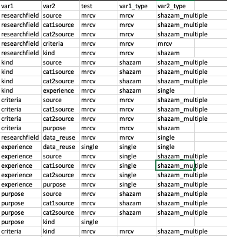

# Project description

## Project title
Data reuse in the Social Sciences and Humanities:
Project report of the SWITCH Innovation Lab “Repositories & Data Quality”

## Project overview
This analysis was performed during a project of the SWITCH Innovation Lab “Repositories & Data Quality”, a project that ran from October 2020 until February 2021 as a collaboration between SWITCH and ZHAW Zurich University of Applied Sciences. The final report can be found here: https://doi.org/10.21256/zhaw-2404

The data is published on zenodo (doi 10.5281/zenodo.4609834)

## Survey Structure


All variables are categorical and are either single response or multiple response variables. For more details, please refer to the report.

The variable source was a free-text-field, in which participants often specified several items. For analysis including the source column, we duplicated the lines in the following way:

Kind 1 | Source 1a, Source 1b, Source 1c | Purpose 1

Is transformed to:

Kind 1 | Source 1a | Purpose 1

Kind 1 | Source 1b | Purpose 1

Kind 1 | Source 1c | Purpose 1



# Code

## Load libraries and functions
```{r}
library(tidyverse)
library(zen4R)
library(readxl)
library(MRCV)
library(viridis)
library(kableExtra)

# load own functions
source("code/misc_functions.R")
source("code/data_cleaning_functions.R")
source("code/plot_functions.R")
source("code/analysis_functions.R")
source("code/create_dummies_functions.R")

# file locations
DATA_DIR <- "data/" # required data
ZEN_DATA_DIR <- "data_zen/" # data from zenodo
PLOT_DIR <- "plots/" # plots 
RES_DIR <- "results/" # results

DICT_SOURCES <- ZEN_DATA_DIR %+% "DictionarySources.xlsx"
DICT_FIELDS <- DATA_DIR %+%   "DictionaryFields.xlsx"
DICT_KINDS <- DATA_DIR %+% "DictionaryKind.xlsx"
DICT_PURPOSES <- DATA_DIR %+% "DictionaryPurpose.xlsx"
DICT_CRITERIA <- DATA_DIR %+% "DictionaryCriteria.xlsx"
STAT_TESTS <- DATA_DIR %+% "stat_tests.xlsx"

# create directories if they do not exist
if (!file.exists(PLOT_DIR)){
    dir.create(PLOT_DIR)
}

if(!file.exists(RES_DIR)) {
  dir.create(RES_DIR)
}

if(!file.exists(ZEN_DATA_DIR)) {
  dir.create(ZEN_DATA_DIR)
}
```

## Download data from Zenodo
We used the package redcapAPI to load the data set directly from REDCap and performed some anonymization and published the dataset on zenodo. This dataset can be loaded directly from zenodo:
```{r}
if (params$download_from_zenodo) {
  download_zenodo("10.5281/zenodo.4609834", path="./" %+% ZEN_DATA_DIR)
}
```

## Read and clean data
Read all the data and additional files for text normalization and labels
```{r}
df <- readRDS(ZEN_DATA_DIR %+% "survey_results.rds") %>%
  ## filter out incomplete records
  filter(survey_switch_innovation_lab_2020_complete == "Complete")

# read list for statistical tests
df_tests <- readxl::read_excel(STAT_TESTS)

# read lookup tables
df_fields_lookup <- readxl::read_excel(DICT_FIELDS, "researchfield")
df_fields_categories_lookup <- readxl::read_excel(DICT_FIELDS, "field_category")
df_categories_lookup <- readxl::read_excel(DICT_FIELDS, "field_category")
df_categories_labels <-  readxl::read_excel(DICT_FIELDS, "category")
df_kind_lookup <- readxl::read_excel(DICT_KINDS, "kind")
df_purpose_lookup <- readxl::read_excel(DICT_PURPOSES, "purpose")
df_criteria_lookup <- readxl::read_excel(DICT_CRITERIA, "criteria")
df_sources_lookup <- readxl::read_excel(DICT_SOURCES, "Tabelle2") %>%
  select(raw, key) %>%
  mutate(raw = str_to_lower(raw),
         raw = str_trim(raw),
         raw =str_replace_all(raw, "[^a-zA-Z0-9\\.;: , :blank:/]", "_"),
         key = str_to_upper(key)) %>%
  filter(!is.na(raw))
df_sources_categories_lookup <- readxl::read_excel(DICT_SOURCES, "Tabelle1")
```


Data cleaning involves mostly normalizing text variables and replacing them with keys.
```{r}
## cleaning the data
df <- df %>%
  mutate_at(vars(starts_with("researchfield_")), normalize_text, df_fields_lookup) %>%
  mutate_at(vars(starts_with("kind_")), str_replace_all, "\\(.*\\)", "") %>%
  mutate_at(vars(starts_with("kind_")), normalize_text, df_kind_lookup %>% select(raw, key)) %>%
  mutate_at(vars(starts_with("criteria_")), str_replace_all, "\\(.*\\)", "") %>%
  mutate_at(vars(starts_with("criteria_")), normalize_text, df_criteria_lookup %>% select(raw, key)) %>%
  mutate_at(vars(starts_with("purpose_")), str_replace_all, "\\(.*\\)", "") %>%
  mutate_at(vars(starts_with("purpose_")), normalize_text, df_purpose_lookup %>% select(raw, key))%>%
  mutate_at(vars(starts_with("purpose_")), str_replace_all, "\\(.*\\)", "_") %>%
  mutate_at(vars(starts_with("source_")), str_replace_all, fixed("Théâtres  	 de 	société: rayonnement du répertoire français entre 1700 et 1799"), "THDS") %>%
  mutate_at(vars(starts_with("source_")), str_replace_all, fixed("Einkommensdaten der  IK"), "EINKIK") %>%
  mutate_at(vars(starts_with("source_")), str_replace_all, "[^a-zA-Z0-9\\.;: , :blank:/]", "_") %>%
  mutate_at(vars(starts_with("source_")), normalize_text, df_sources_lookup %>% select(raw, key)) %>%
  mutate_at(vars(starts_with("source_")), str_replace_all, fixed("different sources like "), "") %>%
  mutate_at(vars(starts_with("source_")), str_replace_all, fixed("z.b. via datenbanken _z.b. "), "") %>%
  mutate_at(vars(starts_with("source_")), str_replace_all, fixed(" et "), ",") %>%
  mutate_at(vars(starts_with("source_")), str_replace_all, fixed(" oder "), ",")%>%
  mutate_at(vars(starts_with("source_")), str_replace_all, fixed(" and "), ",")%>%
  mutate_at(vars(starts_with("source_")), str_replace_all, fixed("_gk"), "") %>%
  mutate_at(vars(starts_with("source_")), str_replace_all, fixed("/"), ",")%>%
  mutate_at(vars(starts_with("source_")), str_replace_all, fixed("_en fait"), "")%>%
  mutate_at(vars(starts_with("source_")), str_replace_all, fixed("u.a."), "")%>%
  mutate_at(vars(starts_with("source_")), str_replace_all, fixed("_"), "")%>%
  mutate_at(vars(starts_with("source_")), str_replace_all, fixed(" wie "), ",")%>%
  mutate_at(vars(starts_with("source_")), str_replace_all, fixed(";"), ",") %>%
  mutate_at(vars(starts_with("source_")), str_replace_all, fixed("thds"), "THDS") %>%
  mutate_at(vars(starts_with("source_")), str_replace_all, fixed("einkik"), "EINKIK") %>%
  mutate_at(vars(starts_with("source_")), str_replace_all, fixed(" "), ",") %>%
  mutate_at(vars(starts_with("source_")), str_trim) 
```


Some additional variables used later.
```{r}
# just for plotting
example_margin <- unit(c(15,5,5,30), "pt")

# just to get the right order for the factor experience
experience_levels <- c("0-5 years", "6-15 years", "16-30 years", "31+ years")

# use only the most common data sources
relevant_sources <- c("FORS","BFS" ,"LIT", "ESS", "DATAOWN", "GESIS", "DATABASELIT", "DATAOTHER", "DATAGOVE", "SURVEY")
```
After analyzing the responses towards the used data sources, we decided to focus on the 10 most often cited sources. These are given in the variable relevant_sources ```r  relevant_sources```

## Descriptive statistics
### Institutions
Absolute count
```{r}
g_institutions <-df %>% ggplot(aes(x=institution)) + 
  geom_bar(stat = "count") +
  geom_text(stat='count', aes(y = after_stat(count) + max(after_stat(count))/10, label=after_stat(count)), vjust=2.5, size=2.5) +
  scale_y_continuous(expand = c(0,0)) +
  scale_x_discrete(guide = guide_axis(angle=45)) +
  xlab("Institution") + ylab("Count") + ##ggtitle("Distribution of institutions") +
  theme_zhaw(panel.grid.major.x.blank = TRUE, keep_ticks = TRUE) 
  

SavePlot(g_institutions, "doc.por", c("institution", "barplot", "count", "alpha"), rootdir = PLOT_DIR)
g_institutions
```
Relative count
```{r}
g_institutions_perc <-df %>% ggplot(aes(x=institution, y=(..count..)/sum(..count..))) + 
  geom_bar(stat = "count") +
  geom_text(stat='count', aes(y = after_stat((..count..)/sum(..count..)) + max(after_stat((..count..)/sum(..count..)))/10, label=scales::percent(after_stat((..count..)/sum(..count..)))), vjust=2.5, size=2.5) +
  scale_y_continuous(expand = c(0,0), labels = scales::percent_format(accuracy = 1)) +
  scale_x_discrete(guide = guide_axis(angle=45)) +
  xlab("Institution") + ylab("Percentage") + #ggtitle("Relative distribution of institutions") +
  theme_zhaw(panel.grid.major.x.blank = TRUE, keep_ticks = TRUE) 

SavePlot(g_institutions_perc, "doc.por", c("institution", "barplot", "perc", "alpha"), rootdir = PLOT_DIR)
g_institutions_perc
```

### Experience
```{r}
g_experience <- df %>% 
  mutate(experience = factor(experience, levels= experience_levels,labels = experience_levels))%>%
  ggplot(aes(x=experience)) + 
  geom_bar(stat = "count") +
  geom_text(stat='count', aes(y = after_stat(count) + max(after_stat(count))/10, label=after_stat(count)), vjust=2.5, size=2.5) +
  scale_y_continuous(expand = c(0,0)) +
  scale_x_discrete(guide = guide_axis(angle=45)) +
  xlab("Experience") + ylab("Count") + 
  theme_zhaw(panel.grid.major.x.blank = TRUE, keep_ticks = TRUE) 
  

SavePlot(g_experience, "doc.por", c("experience", "barplot", "count", "alpha"), rootdir = PLOT_DIR)

g_experience
```

### Research fields
Create a dataframe that contains only researchfield-variables and the record_id
```{r}
df_field <- select_two_variables(df, "researchfield",  additional_to_keep = "record_id", remove_other = TRUE)
df_field
```

#### Frequency of researchfields and multiple selections

Frequency of researchfields
```{r}
researchfield_factorlevelslabels <- create_lookup_vector(df_fields_categories_lookup, "key", "label", arrange_by_size = FALSE)
researchcategory_factorlevelslabels <- create_lookup_vector(df_categories_labels, "key", "label", arrange_by_size = FALSE)
df_field_long <- create_product_df(df_field, var1="researchfield", id_var = "record_id", sep1 = "|") %>%
  mutate(researchcategory = factor(normalize_text(researchfield, df_categories_lookup, pattern = "key", replacement = "category"), 
                                   labels(researchcategory_factorlevelslabels), labels = researchcategory_factorlevelslabels),
         researchfield = factor(researchfield, labels(researchfield_factorlevelslabels), labels = researchfield_factorlevelslabels)
         )

g_researchfields <- df_field_long %>% ggplot(aes(x=fct_infreq(researchfield), fill = researchcategory)) + 
  geom_bar(stat = "count") +
  geom_text(stat='count', aes(y = after_stat(count) + max(after_stat(count))/10, label=after_stat(count)), vjust=2.5, size=2.5) +
  facet_wrap(vars(fct_infreq(researchcategory)), strip.position = "bottom", scales = "free_x", nrow=1) +
  scale_y_continuous(expand=c(0,0)) +
  scale_x_discrete(guide = guide_axis(angle = 45)) +
  xlab("Research field") + ylab("Count") + ##ggtitle("Distribution of research fields") +
  theme_zhaw(base_size = 7, panel.grid.major.x.blank = TRUE, keep_ticks = TRUE) +
  theme(strip.placement = "outside", strip.background = element_blank(), strip.text = element_blank()) +
  scale_fill_viridis(discrete = TRUE, name = "Researchfield Category") +
  theme(plot.margin = unit(c(15,5,5,30), "pt"), legend.position = "bottom")

SavePlot(g_researchfields, "doc.por", c("researchfield", "barplot", "count", "freq"), rootdir = PLOT_DIR)
g_researchfields

```


```{r}
g_researchfields <-df_field_long %>% ggplot(aes(x=fct_infreq(researchfield), fill = researchcategory)) + 
  geom_bar(stat = "count") +
  geom_text(stat='count', aes(y = after_stat(count) + max(after_stat(count))/10, label=after_stat(count)), vjust=2.5, size=2.5) +
  facet_wrap(vars(fct_infreq(researchcategory)), strip.position = "bottom", scales = "free_x", nrow=1) +
  scale_y_continuous(expand=c(0,0)) +
  scale_x_discrete(guide = guide_axis(angle = 45)) +
  xlab("Research field") + ylab("Count") + ##ggtitle("Distribution of research fields") +
  theme_zhaw(panel.grid.major.x.blank = TRUE, keep_ticks = TRUE) +
  theme(strip.placement = "outside", strip.background = element_blank(), strip.text = element_blank()) +
  scale_fill_viridis(discrete = TRUE, name = "Researchfield Category") +
  theme(plot.margin = unit(c(15,5,5,30), "pt"))

SavePlot(g_researchfields, "doc.por", c("researchfield", "barplot", "count", "freq"), rootdir = PLOT_DIR)
g_researchfields
```

The same as percentages
```{r}
g_researchfields_perc <- df_field_long %>% 
  ggplot(aes(x=researchfield, y=(..count..)/sum(..count..), fill = researchcategory)) + 
  geom_bar(stat = "count", position ="dodge2") +
  geom_text(stat='count', aes(y = after_stat((..count..)/sum(..count..)) + max(after_stat((..count..)/sum(..count..)))/10,
                              label=scales::percent(after_stat((..count..)/sum(..count..)))), vjust=3, size=2, angle=45) +
  facet_wrap(vars(researchcategory), strip.position = "bottom", scales = "free_x", nrow=1) +
  xlab("Research field") + ylab("Percentage") + ##ggtitle("Relative distribution of research fields") +
  theme_zhaw(panel.grid.major.x.blank = TRUE, keep_ticks = TRUE) +
  scale_y_continuous(expand = c(0,0), labels = scales::percent_format(accuracy = 1)) +
  scale_x_discrete(guide = guide_axis(angle=45)) +
  theme(strip.placement = "outside", strip.background = element_blank(), strip.text = element_blank()) +
  scale_fill_viridis(discrete = TRUE, name = "Researchfield Category")

SavePlot(g_researchfields_perc, "doc.por", c("researchfield", "barplot", "perc", "freq"), rootdir = PLOT_DIR)
g_researchfields_perc
```

### Other research fields
```{r}
df_fields_other_freq <- df %>% filter(!is.na(researchfield_other)) %>%
  select(Researchfield=researchfield_other) %>%
  mutate(Researchfield=str_to_sentence(Researchfield)) %>%
  group_by(Researchfield) %>%
  summarise(Frequency = n()) %>%
  ungroup() 
df_fields_other_freq
df_fields_other_freq %>% write.csv2("plots/other_fields.csv", row.names = FALSE)


df_fields_other <- df %>% 
  filter(!is.na(researchfield_other)) %>%
  select(researchfield_other, starts_with("researchfield__"), -researchfield___18) 

df_fields_other %>%
  mutate(combined_with = unite(df_fields_other %>% select(-researchfield_other), 
                               temp, sep="-", na.rm=T) %>% pull(temp)) %>%
  select(-starts_with("researchfield___")) %>%
  mutate(combined_with = stringr::str_replace_all(combined_with, "(-)+", "-")) %>%
  mutate(combined_with = stringr::str_replace_all(combined_with, "^-", "")) %>%
  mutate(combined_with = stringr::str_replace_all(combined_with, "-$", "")) %>%
  mutate(combined_with = stringr::str_replace_all(combined_with, fixed("-"), "---")) %>%
  arrange(researchfield_other) %>%
  kable()
```

There are ```r nrow(df_fields_other)``` other research fields.

Distribution of how many research field selections occur in one record
```{r message=FALSE, warning=FALSE}
df_field_long %>% distinct(record_id, .keep_all=TRUE) %>% group_by(n_var1) %>% summarize(count = n()) %>%
  kable(col.names = c("Number of selections", "Count"))
df_field_long %>% distinct(record_id, .keep_all=TRUE) %>% ggplot(aes(x=n_var1)) + 
  geom_histogram() +
  xlab("Number of selections") + ylab("Count") +
  theme_zhaw(base_size = 10)
```

Distribution of how many research category selections occur in one record
```{r}
df_field_long %>% count(record_id, researchcategory) %>% group_by(n) %>% summarize(count = n())%>%
  kable(col.names = c("Number of selections", "Count"))
df_field_long %>% count(record_id, researchcategory) %>% group_by(n) %>%
  ggplot(aes(x=n)) + geom_histogram() +
  theme_zhaw()
```

Researchfield combinations
```{r}
df_combinations <- df_field %>% 
  select(-record_id) %>%
  unite("researchfield", sep="-", na.rm=TRUE) %>%
  mutate(researchfield = stringr::str_replace_all(researchfield, "(-)+", "-")) %>%
  mutate(researchfield = stringr::str_replace_all(researchfield, "^-", "")) %>%
  mutate(researchfield = stringr::str_replace_all(researchfield, "-$", "")) %>%
  mutate(researchfield = stringr::str_replace_all(researchfield, fixed("-"), "---"))

df_combinations %>% group_by(researchfield) %>%
  summarize(count = n()) %>%
  ungroup() %>%
  arrange(desc(count)) %>%
  kable() %>%
  kable_styling()

```
There are `r length(df_combinations$researchfield %>% unique)` combinations of research fields.

### Data Kind
```{r}
var <- "kind"
df_var <- select_two_variables(df, var, var, additional_to_keep = "record_id", remove_other = TRUE)

v_factorlvelslabels <- create_lookup_vector(eval(sym("df_" %+% var %+% "_lookup")), "key", "label", arrange_by_size = FALSE)

df_var_long <- create_product_df(df_var, var1 = var, id_var = "record_id", sep1 = "|") %>% filter(!!sym(var) != "NA") %>%
  mutate(!!var := factor(.data[[var]], labels(v_factorlvelslabels), labels = v_factorlvelslabels)) 


g_var <- plot_distribution(df_var_long, var, add_title = params$add_plot_title, x_label_angle = 45)
g_var_perc <- plot_distribution(df_var_long, var, scale_count = FALSE, add_title = params$add_plot_title, x_label_angle = 45)

SavePlot(g_var, "doc.por", c(var, "barplot", "count", "freq"), rootdir = PLOT_DIR)

SavePlot(g_var_perc, "doc.por", c(var, "barplot", "perc", "alpha"), rootdir = PLOT_DIR)
g_var
g_var_perc
```

### Purpose
```{r}
var <- "purpose"
df_var <- select_two_variables(df, var, var, additional_to_keep = "record_id", remove_other = TRUE)

v_factorlvelslabels <- create_lookup_vector(eval(sym("df_" %+% var %+% "_lookup")), "key", "label", arrange_by_size = FALSE)

df_var_long <- create_product_df(df_var, var1 = var, id_var = "record_id", sep1 = "|") %>% filter(!!sym(var) != "NA") %>%
  mutate(!!var := factor(.data[[var]], labels(v_factorlvelslabels), labels = v_factorlvelslabels)) 

g_var <- plot_distribution(df_var_long, var, add_title = params$add_plot_title, x_label_angle = 45)
g_var_perc <- plot_distribution(df_var_long, var, scale_count = FALSE, add_title = params$add_plot_title, x_label_angle = 45)

SavePlot(g_var, "doc.por", c(var, "barplot", "count", "freq"), rootdir = PLOT_DIR)
SavePlot(g_var_perc, "doc.por", c(var, "barplot", "perc", "alpha"), rootdir = PLOT_DIR)
g_var
g_var_perc
```

### Criteria
```{r}
var <- "criteria"
df_var <- select_two_variables(df %>% select(-criteriaother), var, var, additional_to_keep = "record_id", remove_other = TRUE)

v_factorlvelslabels <- create_lookup_vector(eval(sym("df_" %+% var %+% "_lookup")), "key", "label", arrange_by_size = FALSE)

df_var_long <- create_product_df(df_var, var1 = var, id_var = "record_id", sep1 = "|") %>% filter(!!sym(var) != "NA") %>%
  mutate(!!var := factor(.data[[var]], labels(v_factorlvelslabels), labels = v_factorlvelslabels)) 

g_var <- plot_distribution(df_var_long, var, add_title = params$add_plot_title, x_label_angle = 45)
g_var_perc <- plot_distribution(df_var_long, var, scale_count = FALSE, add_title = params$add_plot_title, x_label_angle = 45)

SavePlot(g_var, "doc.por", c(var, "barplot", "count", "freq"), rootdir = PLOT_DIR)
SavePlot(g_var_perc, "doc.por", c(var, "barplot", "perc", "freq"), rootdir = PLOT_DIR)
g_var
g_var_perc
```

### Sources
```{r}
df_sources <- select_two_variables(df, "source_shazam", additional_to_keep = "record_id", remove_other = TRUE)
df_sources$sources <- unite(df_sources %>% select(-record_id), "sources", sep =",") %>% pull(sources) 

cat_sources_factorlevels <- c("subjectspecific-ind", "subjectspecific-col", "generic", "other")
cat_sources_factorlabels <- c("Subjectspecific (ind.)", "Subjectspecific (col.)", "Generic", "Other")

df_sources_long <- create_product_df(df_sources, "sources", sep1=",") %>% filter(sources != "NA") %>%
  mutate(sources = str_trim(sources)) %>%
  mutate(sources_hl = word(sources, 1, sep="\\."),
         cat_sources = factor(normalize_text(str_to_lower(sources), df_sources_categories_lookup, pattern="key", replacement = "categorization2"),
                              cat_sources_factorlevels, labels = cat_sources_factorlabels)) %>%
  mutate(sources = as.factor(sources), sources_hl = as.factor(sources_hl))

# check that sources are correct
m <- df_sources_long$sources %ni% df_sources_lookup$key
sum(m)
df_sources_long %>% filter(m) %>% pull(sources)

setdiff(df_sources_lookup$key, str_to_upper(df_sources_categories_lookup$key))
## only LIT allowed, because we did not give the key LIT in the sources, only as the higher level category
setdiff(str_to_upper(df_sources_categories_lookup$key), df_sources_lookup$key)
```
Number of sources that could not be associated with a key: ```r m```. 0 is expected, if the normalization is complete.


```{r}
g_sources <- df_sources_long %>% 
  filter(sources_hl %in% relevant_sources) %>%
  mutate(sources_hl = normalize_text(str_to_lower(sources_hl), df_sources_categories_lookup, pattern = "key", replacement = "label_en")) %>%
  plot_distribution("sources_hl", x_lab="Sources", gg_title = "Distribution of Sources", x_label_angle = 45, add_title = params$add_plot_title) 
SavePlot(g_sources, "doc.por", c("sources-highlevel", "barplot", "count", "freq"), rootdir = PLOT_DIR)

# ordered by frequency
g_sources_cat1 <- df_sources_long %>% 
  filter(!is.na(cat_sources)) %>%
  plot_distribution("cat_sources", x_lab="Source categories", gg_title = "Distribution of Sources", x_label_angle = 45, add_title = params$add_plot_title) 
SavePlot(g_sources_cat1, "doc.por", c("sources-cat", "barplot", "count", "freq"), rootdir = PLOT_DIR)

# ordered by level
g_sources_cat12 <- df_sources_long %>% 
  filter(!is.na(cat_sources)) %>%
  plot_distribution("cat_sources", x_lab="Source categories", gg_title = "Distribution of Sources", x_label_angle = 45, add_title = params$add_plot_title, order_freq = FALSE) 
SavePlot(g_sources_cat12, "doc.por", c("sources-cat", "barplot", "count", "level"), rootdir = PLOT_DIR)

g_sources
g_sources_cat1
g_sources_cat12

```

## Correlation Analysis
## Researchfield x Criteria
```{r}
var1 <- "researchfield"
var2 <- "criteria"
## Preparation of the dataset
df_field_criteria <- create_product_df(df%>% select(-criteriaother), var1=var1, var2=var2) 
df_field_criteria$researchcategory <- normalize_text(df_field_criteria$researchfield, df_fields_categories_lookup, pattern="key", replacement = "category")
df_category_criteria <- df_field_criteria %>% select(record_id, researchcategory, criteria) 

df_field_criteria_freq <- df_field_criteria %>%
  group_by(researchcategory, researchfield, criteria) %>%
  summarise(n = n()) %>%
  ungroup %>% filter(criteria != "") %>%
  mutate(researchcategory = factor(researchcategory, labels(researchcategory_factorlevelslabels), labels = researchcategory_factorlevelslabels),
         researchfield = factor(researchfield, labels(researchfield_factorlevelslabels), labels = researchfield_factorlevelslabels)
         ) 

df_field_criteria_freq <- df_field_criteria %>%
  group_by(researchcategory, researchfield, criteria) %>%
  summarise(n = n()) %>%
  ungroup %>% filter(criteria != "") %>%
  mutate(researchcategory = factor(researchcategory, labels(researchcategory_factorlevelslabels), labels = researchcategory_factorlevelslabels),
         researchfield = factor(researchfield, labels(researchfield_factorlevelslabels), labels = researchfield_factorlevelslabels)
         ) 

n_min <- min(df_field_criteria_freq$n, na.rm=T)
n_max <- max(df_field_criteria_freq$n, na.rm=T)

g_ballon <- df_field_criteria_freq %>%
  mutate(criteria = normalize_text(criteria, df_criteria_lookup, pattern = "key", replacement = "label")) %>%
  ggplot(aes(x=criteria, y=researchfield, size=n, colour=researchcategory)) +
  geom_point() +
  scale_y_discrete(limits=rev(researchfield_factorlevelslabels)) +
  scale_colour_viridis(discrete = TRUE, name = "Researchfield Category") +
  scale_size(name = "Count", breaks = c(1,8,16,24,37)) +
  scale_x_discrete(guide = guide_axis(angle=45)) +
  ylab("Research field") + xlab("Criteria") + ##ggtitle("Research field vs. Criteria") +
  theme_zhaw(base_size=7.5)

SavePlot(g_ballon, "custom", c("researchfield-criteria", "balloonplot", "count", "alpha"), rootdir = PLOT_DIR, width=16, height=12, unit="cm")

g_ballon
```

## Researchfield x Data Reuse
```{r}
var1 <- "researchfield"
var2 <- "data_reuse"
var_cat <- "researchcategory"


df_field_data_reuse <- create_product_df(df, var1=var1, var2=var2) 

df_field_data_reuse$researchcategory <- normalize_text(df_field_data_reuse$researchfield, df_fields_categories_lookup, pattern="key", replacement = "category")
df_category_data_reuse <- df_field_data_reuse %>% select(record_id, researchcategory, data_reuse) 


df_field_data_reuse_freq <- df_field_data_reuse %>%
  group_by(researchcategory, researchfield, data_reuse) %>%
  summarise(n = n()) %>%
  ungroup %>% filter(data_reuse != "") %>%
  mutate(researchcategory = factor(researchcategory, labels(researchcategory_factorlevelslabels), labels = researchcategory_factorlevelslabels),
         researchfield = factor(researchfield, labels(researchfield_factorlevelslabels), labels = researchfield_factorlevelslabels)
         ) 

n_min <- min(df_field_data_reuse_freq$n, na.rm=T)
n_max <- max(df_field_data_reuse_freq$n, na.rm=T)

g_ballon <- df_field_data_reuse_freq %>%
  ggplot(aes(x=data_reuse, y=researchfield, size=n, colour=researchcategory)) +
  geom_point() +
  scale_y_discrete(limits=rev(researchfield_factorlevelslabels)) +
  scale_colour_viridis(discrete = TRUE, name = "Researchfield Category") +
  scale_size(name = "Count", breaks = c(1,8,16,24,37)) +
  ylab("Research field") + xlab("Data re-use") + ##ggtitle("Research field vs. Data re-use") +
  theme_zhaw(base_size=8)

SavePlot(g_ballon, "doc.por", c("researchfield-data_reuse", "balloonplot", "count", "alpha"), rootdir = PLOT_DIR)

g_ballon
```

### Researchfield x Kind
```{r}
var1 <- "researchfield"
var2 <- "kind"
var_cat <- "researchcategory"


df_field_kind <- create_product_df(df, var1=var1, var2=var2) 

df_field_kind$researchcategory <- normalize_text(df_field_kind$researchfield, df_fields_categories_lookup, pattern="key", replacement = "category")

df_category_kind <- df_field_kind %>% select(record_id, researchcategory, kind)

v_kind_factorlevelslabels <- create_lookup_vector(eval(sym("df_" %+% "kind" %+% "_lookup")), "key", "label", arrange_by_size = FALSE)

df_field_kind_freq <- df_field_kind %>%
  group_by(researchcategory, researchfield, kind) %>%
  summarise(n = n()) %>%
  ungroup %>% filter(kind != "") %>%
  mutate(researchcategory = factor(researchcategory, labels(researchcategory_factorlevelslabels), labels = researchcategory_factorlevelslabels),
         researchfield = factor(researchfield, labels(researchfield_factorlevelslabels), labels = researchfield_factorlevelslabels),
         kind = factor(kind, labels(v_kind_factorlevelslabels), labels = v_kind_factorlevelslabels)) 

n_min <- min(df_field_kind_freq$n, na.rm=T)
n_max <- max(df_field_kind_freq$n, na.rm=T)

g_ballon <- df_field_kind_freq %>%
  ggplot(aes(x=kind, y=researchfield, size=n, colour=researchcategory)) +
  geom_point() +
  scale_y_discrete(limits=rev(researchfield_factorlevelslabels)) +
  scale_x_discrete(limits=v_kind_factorlevelslabels, guide = guide_axis(angle=45)) +
  scale_colour_viridis(discrete = TRUE, name = "Researchfield Category") +
  scale_size(name = "Count", breaks = c(1,8,16,24,37)) +
  ylab("Research field") + xlab("Kind of source") + ##ggtitle("Research field vs. Kind of source") +
  theme_zhaw(base_size=8)

SavePlot(g_ballon, "doc.por", c("researchfield-kind", "balloonplot", "count", "alpha"), rootdir = PLOT_DIR)

g_ballon
```

### Kind x source
```{r}
var1 <- "kind"
var2 <- "source"

relevant_sources
sources_levels <- df_sources_categories_lookup %>% filter(str_to_upper(key) %in% relevant_sources) %>% pull(key) %>% str_to_upper
sources_labels <- df_sources_categories_lookup %>% filter(str_to_upper(key) %in% relevant_sources) %>% pull(label_en)

df_cross <- df %>%
  create_product_df(var1=var1, var2=var2) %>%
  mutate(source = word(source, 1, sep="\\.")) %>%
  filter(source %in% relevant_sources) %>%
  filter(!is.na(!!sym(var1))) %>%
  filter(!is.na(!!sym(var2))) %>%
  filter(!!sym(var1) != "") %>%
  filter(!!sym(var2) != "") %>%
  filter(!!sym(var1)!= "NA") %>%
  filter(!!sym(var2) != "NA") %>%
  mutate(source_cat = normalize_text(source, lookup_table = df_sources_categories_lookup, pattern = "key", replacement="categorization2")) %>%
  mutate(!!var1 := factor(!!sym(var1), levels = labels(v_kind_factorlevelslabels), labels = v_kind_factorlevelslabels),
         !!var2 := factor(!!sym(var2), levels = sources_levels, labels = sources_labels),
         source_cat := factor(source_cat, levels = cat_sources_factorlevels, labels = cat_sources_factorlabels))

lapply(c(var2, "source_cat"), function(var2) {
  df_cross_freq <- df_cross %>%
    filter(!is.na(!!sym(var2))) %>%
    group_by(!!sym(var1), !!sym(var2)) %>%
    summarise(n = n()) %>%
    ungroup 
  
  n_min <- min(df_cross_freq$n, na.rm=T)
  n_max <- max(df_cross_freq$n, na.rm=T)
  
  g_ballon <- df_cross_freq %>%
    ggplot(aes(x=!!sym(var1), y=!!sym(var2), size=n)) +
    geom_point() +
    scale_size(name = "Count", breaks = c(1,8,16,24,37)) +
    ylab(str_to_sentence(var2)) + xlab("Kind of source") + 
    theme_zhaw(base_size=8)
  
  SavePlot(g_ballon, "doc.por", c(var1 %+% "-" %+% var2, "balloonplot", "count", "alpha"), rootdir = PLOT_DIR)
  
  g_ballon
})
```

### Purpose x Source
```{r}
var1 <- "purpose"
var2 <- "source"

relevant_sources
sources_levels <- df_sources_categories_lookup %>% filter(str_to_upper(key) %in% relevant_sources) %>% pull(key) %>% str_to_upper
sources_labels <- df_sources_categories_lookup %>% filter(str_to_upper(key) %in% relevant_sources) %>% pull(label_en)

purpose_levels <- df_purpose_lookup %>% pull(key)
purpose_labels <- df_purpose_lookup %>% pull(label)

df_cross <- df %>%
  create_product_df(var1=var1, var2=var2) %>%
  mutate(source = word(source, 1, sep="\\.")) %>%
  filter(source %in% relevant_sources) %>%
  filter(!is.na(!!sym(var1))) %>%
  filter(!is.na(!!sym(var2))) %>%
  filter(!!sym(var1) != "") %>%
  filter(!!sym(var2) != "") %>%
  filter(!!sym(var1)!= "NA") %>%
  filter(!!sym(var2) != "NA") %>%
  mutate(source_cat = normalize_text(source, lookup_table = df_sources_categories_lookup, pattern = "key", replacement="categorization2")) %>%
  mutate(!!var1 := factor(!!sym(var1), levels = purpose_levels, labels = purpose_labels),
         !!var2 := factor(!!sym(var2), levels = sources_levels, labels = sources_labels),
         source_cat := factor(source_cat, levels = cat_sources_factorlevels, labels = cat_sources_factorlabels))

lapply(c(var2, "source_cat"), function(var2) {
  df_cross_freq <- df_cross %>%
    filter(!is.na(!!sym(var2))) %>%
    group_by(!!sym(var1), !!sym(var2)) %>%
    summarise(n = n()) %>%
    ungroup 
  
  n_min <- min(df_cross_freq$n, na.rm=T)
  n_max <- max(df_cross_freq$n, na.rm=T)
  
  g_ballon <- df_cross_freq %>%
    ggplot(aes(x=!!sym(var1), y=!!sym(var2), size=n)) +
    geom_point() +
    scale_size(name = "Count", breaks = c(1,8,16,24,37)) +
    scale_x_discrete(guide = guide_axis(angle = 45)) +
    ylab(str_to_sentence(var2)) + xlab(str_to_sentence(var1)) + 
    theme_zhaw(base_size=8)
  
  SavePlot(g_ballon, "doc.por", c(var1 %+% "-" %+% var2, "balloonplot", "count", "alpha"), rootdir = PLOT_DIR)
  
  g_ballon
})
```
### Kind x experience
```{r}

var1 <- "kind"
var2 <- "experience"

df_cross <- create_product_df(df, var1=var1, var2=var2) %>%
  filter(!is.na(!!sym(var1))) %>%
  filter(!is.na(!!sym(var2))) %>%
  filter(!!sym(var1) != "") %>%
  filter(!!sym(var2) != "") %>%
  filter(!!sym(var1)!= "NA") %>%
  filter(!!sym(var2) != "NA") %>%
  mutate(!!var1 := factor(!!sym(var1), levels=labels(v_kind_factorlevelslabels), labels=v_kind_factorlevelslabels),
         !!var2 := factor(!!sym(var2), levels=experience_levels, labels=experience_levels))


df_cross_freq <- df_cross %>%
  group_by(!!sym(var1), !!sym(var2)) %>%
  summarise(n = n()) %>%
  ungroup 

n_min <- min(df_cross$n, na.rm=T)
n_max <- max(df_cross$n, na.rm=T)

g_ballon <- df_cross_freq %>%
  ggplot(aes(x=!!sym(var1), y=!!sym(var2), size=n)) +
  geom_point() +
  scale_size(name = "Count", breaks = c(1,8,16,24,37)) +
  ylab(str_to_sentence(var2)) + xlab("Kind of source") + 
  theme_zhaw(base_size=8)

SavePlot(g_ballon, "doc.por", c(var1 %+% "-" %+% var2, "balloonplot", "count", "alpha"), rootdir = PLOT_DIR)

g_ballon
```


### Purpose x Experience
```{r}
var1 <- "experience"
var2 <- "source"

df_cross <- create_product_df(df, var1=var1, var2=var2) %>%
  filter(!is.na(!!sym(var1))) %>%
  filter(!is.na(!!sym(var2))) %>%
  filter(!!sym(var1) != "") %>%
  filter(!!sym(var2) != "") %>%
  filter(!!sym(var1)!= "NA") %>%
  filter(!!sym(var2) != "NA") %>%
  mutate(source_cat = normalize_text(source, lookup_table = df_sources_categories_lookup, pattern = "key", replacement="categorization2")) %>%
  mutate(source = word(source, 1, sep="\\.")) %>%
  mutate(!!var1 := as.factor(!!sym(var1)),
         !!var2 := as.factor(!!sym(var2)),
         source_cat := as.factor(source_cat))

lapply(c(var2, "source_cat"), function(var2) {
  df_cross_freq <- df_cross %>%
    filter(!is.na(!!sym(var2))) %>%
    group_by(!!sym(var1), !!sym(var2)) %>%
    summarise(n = n()) %>%
    ungroup 
  
  n_min <- min(df_cross_freq$n, na.rm=T)
  n_max <- max(df_cross_freq$n, na.rm=T)
  
  g_ballon <- df_cross_freq %>%
    ggplot(aes(x=!!sym(var1), y=!!sym(var2), size=n)) +
    geom_point() +
    scale_size(name = "Count", breaks = c(1,8,16,24,37)) +
    ylab(str_to_sentence(var2)) + xlab(str_to_sentence(var1)) + 
    theme_zhaw(base_size=8)
  
  SavePlot(g_ballon, "doc.por", c(var1 %+% "-" %+% var2, "balloonplot", "count", "alpha"), rootdir = PLOT_DIR)
  
  g_ballon
})
```


### Purpose x kind
```{r}

var1 <- "purpose"
var2 <- "kind"

df_cross <- create_product_df(df %>% select(-criteriaother), var1=var1, var2=var2) %>%
  filter(!is.na(!!sym(var1))) %>%
  filter(!is.na(!!sym(var2))) %>%
  filter(!!sym(var1) != "") %>%
  filter(!!sym(var2) != "") %>%
  filter(!!sym(var1)!= "NA") %>%
  filter(!!sym(var2) != "NA") %>%
  mutate(!!var1 := as.factor(!!sym(var1)),
         !!var2 := as.factor(!!sym(var2)))


calculate_chi2(df_cross, var1, var2) %>% kable()

df_cross_freq <- df_cross %>%
  group_by(!!sym(var1), !!sym(var2)) %>%
  summarise(n = n()) %>%
  ungroup 

n_min <- min(df_cross$n, na.rm=T)
n_max <- max(df_cross$n, na.rm=T)

g_ballon <- df_cross_freq %>%
  ggplot(aes(x=!!sym(var1), y=!!sym(var2), size=n)) +
  geom_point() +
  # scale_y_discrete(limits=rev(researchfield_factorlevelslabels)) +
  # scale_colour_viridis(discrete = TRUE, name = "Researchfield Category") +
  scale_size(name = "Count", breaks = c(1,8,16,24,37)) +
  ylab(str_to_sentence(var2)) + xlab(str_to_sentence(var1)) + ##ggtitle(str_to_sentence(var1) %+% " vs. " %+% str_to_sentence(var2)) +
  theme_zhaw(base_size=8)

SavePlot(g_ballon, "doc.por", c(var1 %+% "-" %+% var2, "balloonplot", "count", "alpha"), rootdir = PLOT_DIR)

g_ballon
```

### Purpose x Criteria
```{r}

var1 <- "purpose"
var2 <- "criteria"

df_cross <- create_product_df(df %>% select(-criteriaother), var1=var1, var2=var2) %>%
  filter(!is.na(!!sym(var1))) %>%
  filter(!is.na(!!sym(var2))) %>%
  filter(!!sym(var1) != "") %>%
  filter(!!sym(var2) != "") %>%
  filter(!!sym(var1)!= "NA") %>%
  filter(!!sym(var2) != "NA") %>%
  mutate(!!var1 := as.factor(!!sym(var1)),
         !!var2 := as.factor(!!sym(var2)))

df_cross_freq <- df_cross %>%
  group_by(!!sym(var1), !!sym(var2)) %>%
  summarise(n = n()) %>%
  ungroup 

n_min <- min(df_cross$n, na.rm=T)
n_max <- max(df_cross$n, na.rm=T)

g_ballon <- df_cross_freq %>%
  ggplot(aes(x=!!sym(var1), y=!!sym(var2), size=n)) +
  geom_point() +
  # scale_y_discrete(limits=rev(researchfield_factorlevelslabels)) +
  # scale_colour_viridis(discrete = TRUE, name = "Researchfield Category") +
  scale_size(name = "Count", breaks = c(1,8,16,24,37)) +
  ylab(str_to_sentence(var2)) + xlab(str_to_sentence(var1)) + ##ggtitle(str_to_sentence(var1) %+% " vs. " %+% str_to_sentence(var2)) +
  theme_zhaw(base_size=8)

SavePlot(g_ballon, "doc.por", c(var1 %+% "-" %+% var2, "balloonplot", "count", "alpha"), rootdir = PLOT_DIR)

g_ballon
```

### Criteria x kind
```{r}

var1 <- "criteria"
var2 <- "kind"

df_cross <- create_product_df(df %>% select(-criteriaother), var1=var1, var2=var2) %>%
  filter(!is.na(!!sym(var1))) %>%
  filter(!is.na(!!sym(var2))) %>%
  filter(!!sym(var1) != "") %>%
  filter(!!sym(var2) != "") %>%
  filter(!!sym(var1)!= "NA") %>%
  filter(!!sym(var2) != "NA") %>%
  mutate(!!var1 := as.factor(!!sym(var1)),
         !!var2 := as.factor(!!sym(var2)))


df_cross_freq <- df_cross %>%
  group_by(!!sym(var1), !!sym(var2)) %>%
  summarise(n = n()) %>%
  ungroup 

n_min <- min(df_cross$n, na.rm=T)
n_max <- max(df_cross$n, na.rm=T)

g_ballon <- df_cross_freq %>%
  ggplot(aes(x=!!sym(var1), y=!!sym(var2), size=n)) +
  geom_point() +
  # scale_y_discrete(limits=rev(researchfield_factorlevelslabels)) +
  # scale_colour_viridis(discrete = TRUE, name = "Researchfield Category") +
  scale_size(name = "Count", breaks = c(1,8,16,24,37)) +
  ylab(str_to_sentence(var2)) + xlab(str_to_sentence(var1)) + ##ggtitle(str_to_sentence(var1) %+% " vs. " %+% str_to_sentence(var2)) +
  theme_zhaw(base_size=8)

SavePlot(g_ballon, "doc.por", c(var1 %+% "-" %+% var2, "balloonplot", "count", "alpha"), rootdir = PLOT_DIR)

g_ballon
```

### Criteria x Source
```{r}
var1 <- "criteria"
var2 <- "source"

df_cross <- create_product_df(df %>% select(-criteriaother), var1=var1, var2=var2) %>%
  filter(!is.na(!!sym(var1))) %>%
  filter(!is.na(!!sym(var2))) %>%
  filter(!!sym(var1) != "") %>%
  filter(!!sym(var2) != "") %>%
  filter(!!sym(var1)!= "NA") %>%
  filter(!!sym(var2) != "NA") %>%
  mutate(source_cat = normalize_text(source, lookup_table = df_sources_categories_lookup, pattern = "key", replacement="categorization2")) %>%
  mutate(source = word(source, 1, sep="\\.")) %>%
  mutate(!!var1 := as.factor(!!sym(var1)),
         !!var2 := as.factor(!!sym(var2)),
         source_cat := as.factor(source_cat))


lapply(c(var2, "source_cat"), function(var2) {
  df_cross_freq <- df_cross %>%
    filter(!is.na(!!sym(var2))) %>%
    group_by(!!sym(var1), !!sym(var2)) %>%
    summarise(n = n()) %>%
    ungroup  %>%
    arrange(n) 
  
  n_min <- min(df_cross$n, na.rm=T)
  n_max <- max(df_cross$n, na.rm=T)
  
  g_ballon <- df_cross_freq %>%
    ggplot(aes(x=!!sym(var1), y=!!sym(var2), size=n)) +
    geom_point() +
    scale_size(name = "Count", breaks = c(1,8,16,24,37)) +
    ylab(str_to_sentence(var2)) + xlab(str_to_sentence(var1)) + 
    theme_zhaw(base_size=8)
  
  SavePlot(g_ballon, "doc.por", c(var1 %+% "-" %+% var2, "balloonplot", "count", "alpha"), rootdir = PLOT_DIR)
  
  g_ballon
})
```

### Data reuse x Experience
```{r}
var1 <- "experience"
var2 <- "data_reuse"

df_cross <- df %>% select(record_id, experience, data_reuse)

calculate_chi2(df_cross, var1, var2) %>% kable()


df_cross_freq <- df_cross %>%
    filter(!is.na(!!sym(var2))) %>%
    group_by(!!sym(var1), !!sym(var2)) %>%
    summarise(n = n()) %>%
    ungroup  %>%
    arrange(n) 
  
n_min <- min(df_cross$n, na.rm=T)
n_max <- max(df_cross$n, na.rm=T)

g_ballon <- df_cross_freq %>%
  ggplot(aes(x=!!sym(var1), y=!!sym(var2), size=n)) +
  geom_point() +
  scale_size(name = "Count", breaks = c(1,8,16,24,37)) +
  ylab("Data reuse") + xlab(str_to_sentence(var1)) + 
  theme_zhaw(base_size=8)

SavePlot(g_ballon, "doc.por", c(var1 %+% "-" %+% var2, "balloonplot", "count", "alpha"), rootdir = PLOT_DIR)

g_ballon

```

### All multiple response variables
```{r warning=FALSE}
# Example combination for one pair of questions
# Setting params$perform_all_tests to FALSE, if you want to run the test for a specific combination
var1 <- "purpose"
var2 <- "source"
#var2 <- "data_reuse"
var1_type <- "shazam"
var2_type <- "shazam_multiple"
#var2_type <- "single"

# bon or boot for bonferroni or bootstrap test
test_type <- "bon"

df_tests_mrcv <- df_tests %>% filter(test == "mrcv") %>%
  ## ignore the source categories
  filter(var2 != "cat_source")

## example for one question pair
if (!params$perform_all_tests){
  single_res <- mrcv_test(df_mrcv, var1 = var1, var2 = var2, var1_type = var1_type, var2_type = var2_type, test_type=test_type, return_df=TRUE)
  single_res$df
  single_res$res
} else {

  res <- lapply(1:nrow(df_tests_mrcv), function(x) {
    res <- mrcv_test(df_mrcv, df_tests_mrcv$var1[x], df_tests_mrcv$var2[x], df_tests_mrcv$var1_type[x], df_tests_mrcv$var2_type[x], test_type=test_type)
    row_res <- as_tibble_row(c(var1=df_tests_mrcv$var1[x], var2=df_tests_mrcv$var2[x], 
                               x2=res$general$X.sq.S, 
                               p=res$bon$p.value.bon))
    return(list(res=res, row=row_res))
  })
  
  tbs <- lapply(res, function(x) {
    return(x$row)
  }) 
  
  ps <- lapply(res, function(x) {
    res_bon <- x$res$bon$X.sq.S.ij.p.bon
    p_tibble <- as_tibble(res_bon, rownames = "var1") %>% gather(key="var2", value="p", -var1)
  })
  
  write.csv2(ps %>% bind_rows(), "results/mrcv_bon_pairs.csv", row.names = FALSE)
  
  # for bootstrapping
  if (test_type == "boot"){
    p.boot <- sapply(res, function(x) {
        x$res$boot$p.value.boot
    } )
    tbs %>% bind_rows() %>% mutate(p_boot = p.boot) %>% write.csv2("plots/mrcv_" %+% test_type %+% ".csv", row.names = FALSE)
  } else {
    tbs %>% bind_rows() %>% write.csv2("plots/mrcv_" %+% test_type %+%  ".csv", row.names = FALSE)
  }
  
  res_output <- lapply(res, function(x) {
    return(x$res)
  })
  capture.output(res_output, file="plots/mrcv_" %+% test_type %+% "_results.txt")
}

```

```{r}
if (params$perform_all_tests) {
  lapply(ps, function(x){
    m <- !grepl("source", x$var2, fixed = TRUE) | x$var2 %in% paste0("source.", str_to_lower(relevant_sources))
    x <- x[m,]
    x %>% filter(p < 0.05) #%>% filter(!str_detect(var1, "^source") | var1 %in% relevant_sources)
  }) %>% bind_rows() %>% writexl::write_xlsx("results/mrcv_bon.xlsx")
} else {
  res <- single_res$res
  res_bon <- res$bon$X.sq.S.ij.p.bon
  m <- res_bon < 0.05
  as_tibble(res_bon, rownames = "var1") %>% gather(key="var2", value="p", -var1) %>%
  # filter(var2 %in% paste0("source.", str_to_lower(relevant_sources))) %>%
  filter(p < 0.05) %>% writexl::write_xlsx("results/mrcv_bon_" %+% var1 %+% "-" %+% var2 %+% ".xlsx")
}
```
The results (console output) is stored as text file [here (results/mrcv_bon_results.txt)](results/mrcv_bon_results.txt)


